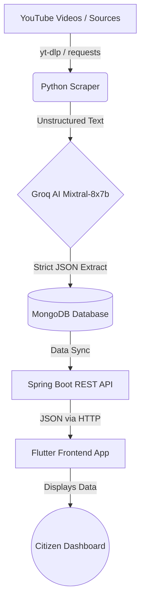

# 🏛️ Gov Subsidy Tracker (Infosys Springboard 7.0)

Welcome to the **Gov Subsidy Tracker**! This project is a comprehensive, full-stack AI-powered solution built to democratize access to government schemes and subsidies. It automates the process of finding, structuring, and displaying government scheme information to citizens.

---

## 🌟 The Vision

Citizens often miss out on beneficial government subsidies because the information is scattered across videos, news articles, and complex websites. 
This project **solves this problem** by:
1. **Automatically scraping** reliable sources (like YouTube news channels).
2. **Using advanced AI** to read unstructured text and extract precise details (Amount, Eligibility, State).
3. **Displaying it beautifully** on a cross-platform mobile and web application for citizens.

---

## 🏗️ System Architecture

The project is divided into three highly decoupled micro-environments. Here is how data flows through the system:

### 1. 🐍 Data Pipeline (`/data_pipeline`)
The intelligence engine of the project. It automatically finds schemes and structures them.
* **Tech Stack**: Python, `yt-dlp`, `requests`, `groq`, `pymongo`
* **How it works**:
  * **Extraction**: Targets specific channels (e.g., *MarathiCorner*) to download video metadata.
  * **AI Parsing (`ai_parser.py`)**: Sends the raw video descriptions to the **Groq API** using the `mixtral-8x7b-32768` model. The AI is heavily prompt-engineered to return a strict, predictable JSON object containing the `amount`, `eligibilityCriteria`, `state`, and `category`.
  * **Database Loading**: Pushes the structured data directly into MongoDB.

### 2. ☕ Backend REST API (`/backend`)
The secure middleman serving data to the users.
* **Tech Stack**: Java 21, Spring Boot 4.1.0, Spring Security, H2 Database / Firebase.
* **How it works**:
  * Acts as the primary backend server running on port `8080`.
  * Configured with an embedded `H2` database for rapid development and testing.
  * Securely manages Google Cloud / Firebase credentials via `serviceAccountKey.json`.
  * **CI/CD Integrated**: Includes a GitHub Actions workflow (`.github/workflows/backend-build.yml`) that securely injects cloud credentials without leaking them to the public repository.

### 3. 📱 Frontend Citizen App (`/frontend`)
A beautiful, highly accessible dashboard for end-users.
* **Tech Stack**: Flutter, Dart.
* **How it works**:
  * **Cross-Platform**: Compiles to Android, iOS, Web, Windows, macOS, and Linux from a single codebase.
  * **UI/UX**: Implements a premium `Material 3` design system using a deep blue (`#1E88E5`) and emerald green (`#00BFA5`) color palette for a trustworthy, government-tier aesthetic.
  * Consumes the Spring Boot API to populate the **Citizen Dashboard** where users can filter schemes by state or category.

---

## 🚀 Step-by-Step Setup Guide

If you want to run this project on your local machine, follow these instructions:

### Prerequisites
* Python 3.9+
* Java 21 JDK
* Flutter SDK (v3.11.4+)
* Groq API Key

### Phase 1: Seed the Data
1. Open terminal and navigate: `cd data_pipeline`
2. Install Python dependencies: `pip install -r requirements.txt`
3. Create a `.env` file and add your AI key: `GROQ_API_KEY=your_key_here`
4. Run the scraper: `python main_scraper.py`
   *(Watch as the AI structures YouTube descriptions into database entries!)*

### Phase 2: Start the Server
1. Navigate to the backend: `cd backend`
2. Run the Spring Boot server using Gradle:
   * Windows: `gradlew.bat bootRun`
   * Mac/Linux: `./gradlew bootRun`
3. The server will start on `http://localhost:8080`.

### Phase 3: Launch the App
1. Navigate to the frontend: `cd frontend`
2. Install Flutter packages: `flutter pub get`
3. Run the app on your connected device or emulator: `flutter run`

---

## 🔐 Security Notice
This project uses automated GitHub Actions for deployment. Environment variables and Service Account Keys (`.env`, `serviceAccountKey.json`) are strictly added to `.gitignore` to prevent credential exposure. Deployment pipelines rely on GitHub Secrets for secure credential injection.
